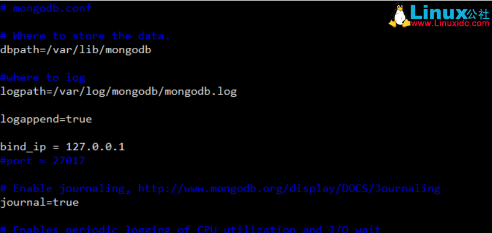

# 安装

```
sudo apt-get install mongodb
```

# 配置

## 启动、停止或者重启

```
sudo service mongodb start
sudo service mongodb stop
sudo service mongodb restart
```

## 编辑配置文件

 ```
sudo vi /etc/mongodb.conf
```

如图：



然后重启服务来使配置生效。

```
sudo service mongodb restart
```

然后启动服务：

```
sudo mongod --dbpath=/var/lib/mongodb
```

然后就可以连接到这个server上了。

## studio 3T for MongoDB连接远程数据库

Connect-->>New Connection-->>填写ip地址和断口名称就可以连接了！
