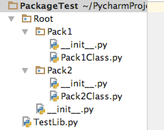
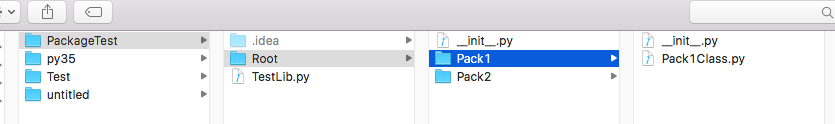

# python中的__init.py文件的作用

## 详解

**先来看一个目录结构：**





python中，每个package实际上是一个目录（Directory),那么IDE是怎么识别它为package呢？没错，`__init__.py`的第一个作用就是package的标识，如果没有该文件，该目录就不会认为是package。

Python中的包和模块有两种导入方式：精确导入和模糊导入：

精确导入：

```
from Root.Pack1 import Pack1Class

import Root.Pack1.Pack1Class
```
模糊导入：

```
from Root.Pack1 import *
```
模糊导入中的*中的模块是由`__all__`来定义的，`__init__.py`的另外一个作用就是定义package中的`__all__`，用来模糊导入，如`__init__.py`：


```
__all__ = ["Pack1Class","Pack1Class1"]
```
在包外部调用：

```
from Root.Pack1 import *

a = Pack1Class.Pack1_AA("Alvin")

a.PrintName()
```


`__init__.py`首先是一个python文件，所有还可以用来写python模块，但是不建议这么写，尽量保证`__init__.py`足够轻：

`__init__.py`:

复制代码
`__all__ = ["Pack1Class","Pack1Class1","Init_AA"]`

```
class Init_AA:
    def __init__(self,name):
        self.name = name

    def Greeting(self):
        print("Hello ",self.name)
```
复制代码

在测试中调用：

```
from Root.Pack1 import *

b = Init_AA("test")

b.Greeting()
```


## **总结：**

从上边的例子可以看出，`__init__.py`的主要作用是：

1. Python中package的标识，不能删除

2. 定义__all__用来模糊导入

3. 编写Python代码(不建议在`__init__`中写python模块，可以在包中在创建另外的模块来写，尽量保证`__init__.py`简单）
