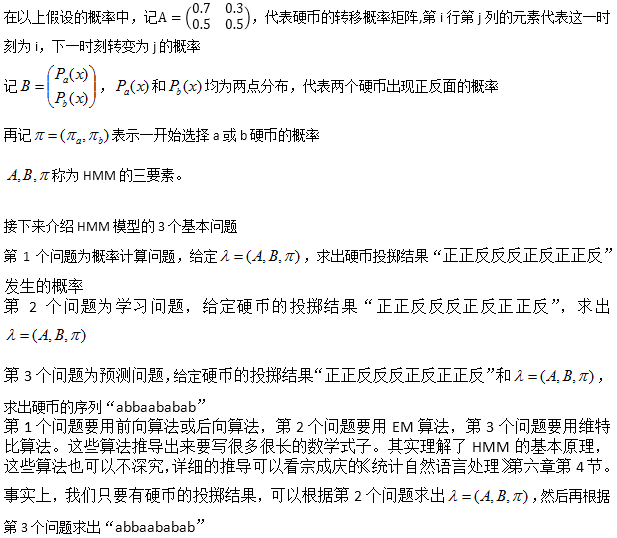
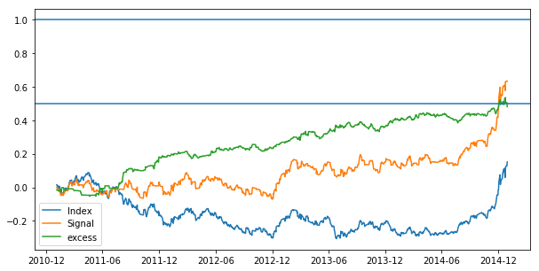
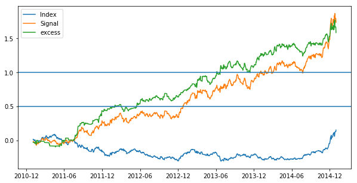

传闻说复兴科技就是使用了HMM,是西蒙斯的赚钱秘籍，但是HMM看起来高大上，特别难懂。下面我想带大家认识一下HMM模型

现在有甲乙两个人，甲投硬币，乙看硬币的正反面。 甲手上有两枚硬币(硬币a和硬币b)。甲随机投一枚硬币，乙看硬币的正反面，但不知道该硬币是哪一枚。

现在甲投了10枚硬币，硬币分别为：abbaababab

乙看到了10次投掷的结果，分别为：正正反反反正反正正反


现在假设（随便编的）：

1. a硬币出现正面的概率为0.7，出现反面的概率为0.3；

2. b硬币出现正面的概率为0.4，出现反面的概率为0.6；

3. 若甲投了a硬币，则下一次投a硬币的概率为0.7，投b硬币的概率为0.3；

4. 若甲投了b硬币，则下一次投a硬币的概率为0.5，投b硬币的概率为0.5。

看到这里，其实已经可以知道了HMM模型是什么了。乙所观测到的序列 “正正反反反正反正正反”，其实背后有一个看不见的序列“abbaababab”在起作用。在HMM模型中，只要给定观测序列，它将试图猜出背后看不见的序列。不仅如此，还试图猜出以上假设的各种概率（如a硬币出现正面的概率，这次投a下次还投a的概率）

hmm基本原理如下图：



下面我们看一下python如何实现HMM

```py
import numpy as np
from hmmlearn import hmm  #在hmmlearn库里面导入hmm模块
O=np.array([1,0,0,1,1,0,0,1,1,0,1,1,0]) #我们设置一组观测值序列，类似于硬币出现的正反面结果
O.shape=(len(1),1)  #行数代表观测数目，列数代表维度
model=hmm.MultinomialHMM(n_components=3) #定义一个离散型的HMM模型，这里设置状态个数为3，即有3枚硬币
np.random.seed(1) #接下来要设置一个随机种子，因为要使用EM算法，每一次计算的结果都有可能不同
model.fit(O) #这里它将计算出各种概率（如a硬币出现正面的概率；这次投a下次还投a的概率）
print model.emissionprob_  #可以查看各个硬币出现正面或反面的概率
print model.transmat_ #可以查看硬币之间的转移概率（如这次投a下次还投a的概率）
print model.predict(O) #现在可以预测背后看不见的隐藏状态（硬币）了
print model.predict_proba(O) #也许不敢肯定预测的隐藏状态一定正确，但可以猜个概率吧

```

接下来再看一个正态分布的例子，假设现在有m个状态，每一个状态都会产生服从正态分布的观测值，但均值和方差由状态来决定。其实就是上面硬币的例子，B中的两点分布改成正态分布。

```
np.random.seed(1)
params=np.random.randint(3,size=2000) #随机产生2000个0,1,2的整数
X=params+np.random.randn(2000) #产生服从3个正态分布的随机数  ~N(0,1),~N(1,1),~N(2,1)
X.shape=(len(X),1) #同样,行数为观测数
model=hmm.GaussianHMM(n_components=3) #定义一个高斯HMM模型，设置状态的个数为3
model.fit(X) #拟合数据，这里将计算出3个正态分布对应的均值和方差，以及转移概率
print model.means_ #正态分布的均值
print model.covars_ #协方差，由于观测变量只有一个，故协方差矩阵只有一个元素，即方差
print model.transmat_ #转移概率
print model.fit(X) #预测背后隐藏的状态序列
```

假如我们事先知道了不同的状态产生的随机数只是均值不同，方差相同，那么我们可以将`model=hmm.GaussianHMM(n_components=3)`改为`model=hmm.GaussianHMM(n_components=3,covariance_type='tied')`，这样可以减少模型需要估计的参数。当我们的观测变量不只一个，而是有N个变量，即`X.shape`是`(len(X),N)`，如果变量之间没有相关性，则`covariance_type` 设置为`'diag'`，如果变量之间有相关性，则`covariance_type`设置为`'full'`

现在还有一个问题，我们一般情况下只能看到X的取值，并不知道X背后是由多少个状态产生的（就像并不知道有多少枚硬币），也不知道不同状态的方差是不是相等，这个时候模型参数的设置应该如何选择？

这时候我们可以利用AIC和BIC准则,不过这两个准则也只是一个参考

$$ AIC = - 2 \times logL + 2 \times p $$

$$ BIC = - 2\times logL + p\times logT$$

其中`logL`为对数似然值，可以调用`model.score(X)`来得到，p为模型需要估计的参数，这里需要估计的参数有 3*3+3*2，即转移概率矩阵的9个概率值和3个状态的均值和方差，T为观测值的个数。在模型的选择上，AIC和BIC的取值越小越好，更详细的HMM理论可以看Hidden Markov Models for Time Series - AnIntroduction Using R这本书

好了，说了这么多，还是看看实际的例子吧

我们将用HMM模型对上证指数做一个择时。


**HMM上证指数择时，这里做了两个HMM模型**

```py
import numpy as np
import pandas as pd

#000001.txt包含上证指数的所有日数据，需要自己把数据下载到本地
data=pd.read_table("D:/000001.txt",header=1).iloc[:-1,[0,1,2,3,4,5]]
data.columns=['date','open','high','low','close','volume']
data['V/MA']=data['volume']/data['volume'].rolling(15).mean() #成交量与过去15天平均成交量的比值
data=data.set_index('date')

data.index=pd.to_datetime(data.index)
data=data['2005':'2014'] #截取数据

#提取特征，做适当地缩放后，做fisher变换
O1=0.4*((data['close']-data['open'])/(data['high']-data['low'])).values
O1.shape=(len(O1),1)
O1=np.log((1+O1)/(1-O1))

O2=data['V/MA'].values/(data['high']/data['low']).values
O2.shape=(len(O2),1)
O2=0.2*np.log(O2)
O2=np.log((1+O2)/(1-O2))

#Ob1=np.hstack((O1,O2))
Ob1=O1 #第一个HMM模型的观测数据
Ob2=O2 #第二个HMM模型的观测数据

Return=(data['close']/data['open']-1).values #求出每一天的日对数收益率
from hmmlearn import hmm
len1=len(data[:'2010']) #2010年以前的数据作为训练数据
len2=len(data['2011':]) #2011年以后的数据作为回测数据
Signal=np.zeros(len2)
np.random.seed(1)
N_state1=3 #第一个HMM隐藏状态的个数设置为3
N_state2=4 #第二个HMM隐藏状态的个数设置为4

for i in range(len2):
    #滚动训练，每个月更新一次
    if data.index[len1+i-1].month!=data.index[len1+i].month:
        remodel1=hmm.GaussianHMM(n_components=N_state1)
        remodel1.fit(Ob1[:len1+i])
        remodel2=hmm.GaussianHMM(n_components=N_state2)
        remodel2.fit(Ob2[:len1+i])
    s_pre1=remodel1.predict(Ob1[:len1+i]) #对历史数据做状态序列的预测
    s_pre2=remodel2.predict(Ob2[:len1+i])
    Re=Return[:len1+i] #取出历史数据的收益率序列
    #各个状态在历史数据中的平均收益率
    Expect=np.array([np.mean(Re[(s_pre1==j)*(s_pre2==k)]) \
                     for j in range(N_state1) for k in range(N_state2)])
    #各个状态在第二天的发生概率
    Pro=np.array([remodel1.transmat_[s_pre1[-1],j]*remodel2.transmat_[s_pre2[-1],k]\
                  for j in range(N_state1) for k in range(N_state2)])
    preReturn=Pro.dot(Expect) #根据转移概率矩阵预测下一天的期望收益
    if preReturn>0.:
        Signal[i]=1
sReturn=(data['close']/data['close'].shift(1))[len1:]-1 #回测阶段的日简单收益率
#考虑万分之六的交易成本
Cost=pd.Series(np.zeros(len(Signal)),index=sReturn.index)
for i in range(1,len(Signal)):
    if Signal[i-1]!=Signal[i]:
        Cost.values[i]=0.0006
SignalRe=np.cumprod(Signal*(sReturn-Cost)+1)-1 #策略的累计收益率
IndexRe=np.cumprod(sReturn+1)-1 #基准的累计收益率
import matplotlib.pyplot as plt
plt.figure(figsize=(10,5))
plt.plot(IndexRe,label='Index')
plt.plot(SignalRe,label='Signal')
plt.plot(SignalRe-IndexRe,label='excess')
plt.axhline(y=1)
plt.axhline(y=0.5)
plt.legend()
plt.show()
```

回测的表现如下：



<<<<<<< HEAD
<<<<<<< HEAD
如果考虑可以做空的情况，即预测下跌时可以卖空，只需把Signal=zeros(len2)改成Signal=-ones(len2),结果为:

=======
如果考虑可以做空的情况，即预测下跌时可以卖空，只需把Signal=zeros(len2)改成Signal=-ones(len2),结果为
>>>>>>> 2fba5a053c2dab190d897654fcea8ec60f098de0
=======
如果考虑可以做空的情况，即预测下跌时可以卖空，只需把Signal=zeros(len2)改成Signal=-ones(len2),结果为
>>>>>>> 15874ae90cc6d8fb7b393d108312600e10471d02


看起来似乎很厉害！！！作为机器学习的一个模型，确实在金融预测中起到了作用。不过可惜似乎只在这一段时间看起来有效。这里只是作为一个HMM模型学习的一个例子，还不能成为实战中的策略

事实上我们利用的数据不应该局限于指数的行情数据，我们可以构建一些更有代表性的观测值，使得模型能够更好地识别出指数的涨跌情况。
