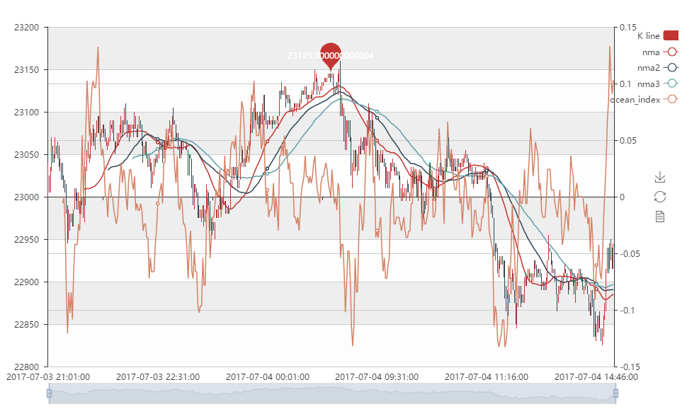
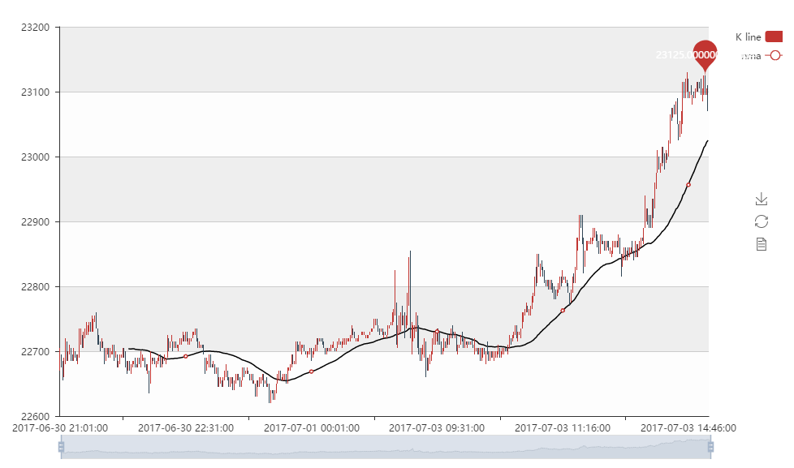
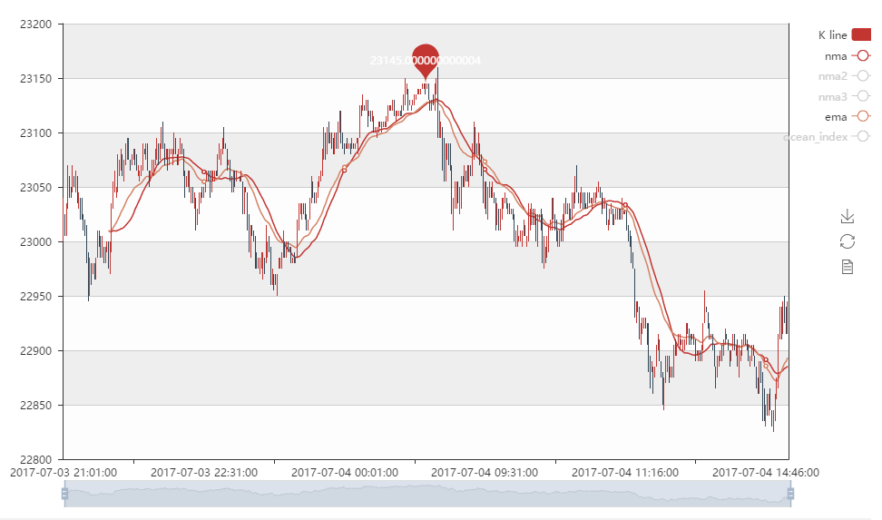
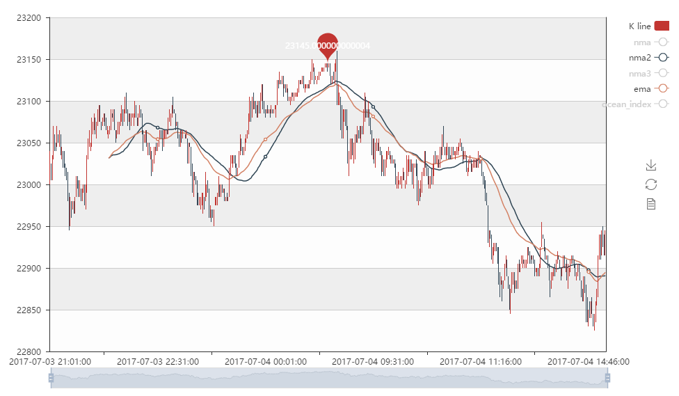
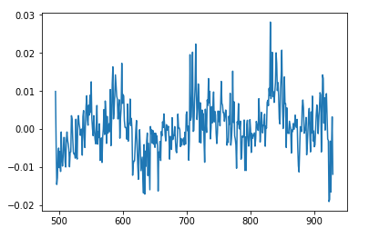

the codes:
自然市场河流 natural market river
```py
def calc_NMR(x):
    time_distance_list = np.array([len(x)-i-1 for i in range(len(x))])
    sq_time_list = np.sqrt(time_distance_list)
    sq_time_list = sq_time_list[1:] - sq_time_list[:-1]
    delta_p_list = np.log(x[1:]) - np.log(x[:-1])
    NMR = np.sum(sq_time_list*delta_p_list)
    return NMR
```

自然市场平均 natural market average

```py
def calc_nma(x):
    alpha = calc_NMR(x)
    numerator = np.sum(np.array( [np.power((1-alpha), i)*x[i] for i in range(len(x)) ]  ))
    denominator = np.sum(np.array( [ np.power((1-alpha),i) for i in range(len(x)) ] ))
    nma = numerator/denominator
    return nma
```

海洋指数

```py
def calc_ocean_index(x):
    ocean_index = (np.log(x[-1]) - np.log(x[0]))/np.sqrt(len(x))
    return ocean_index*100
```

使用示例：

```py
data['nmr'] = data.close.rolling(30).apply(calc_NMR, raw=True)
data['nma'] = data.close.rolling(30).apply(calc_nma, raw=True)
data['nma2'] = data.close.rolling(50).apply(calc_nma, raw=True)
data['nma3'] = data.close.rolling(70).apply(calc_nma, raw=True)
data['ocean_index'] = data.close.rolling(13).apply(calc_ocean_index, raw=True)

kline = plot_kline(data)
line = plot_lines(data, cols = ['nma'])
line2 = plot_lines(data, cols = ['nma2'])
line3 = plot_lines(data, cols = ['nma3'])
ocean_index = plot_lines(data, cols = ['ocean_index'])

overlap = init_overlap(page_title = '',width=1000, height=600)
overlap = add_overlap(overlap, figs = [kline, line,line2,line3])
overlap = add_overlap_with_yaxis(overlap, [ocean_index])
overlap
```

效果分别如下：
自然市场平均和海洋指数



周期为50的nma



周期均为30的nma和ema的对比



周期均为50的nma和ema的对比


nmr分布




总结：

1. nma（自然市场平均）这个指标是在ema的基础上进行改进的，只是改变了ema的算法中的alpha的值的确定方式，因此具有ema的特征。
2. 但是这个指数比ema更加陡峭，或者说波动的幅度会更大，对周期的刻画可能会更好，但是敏感度不一定会增加，不过太敏感对于趋势的捕捉不一定是好事，能够捕捉更长期的趋势，过滤小的波动，配合海洋指数，可以对市场进行比较灵敏的判断，获得比较好的入场点和出场点。
