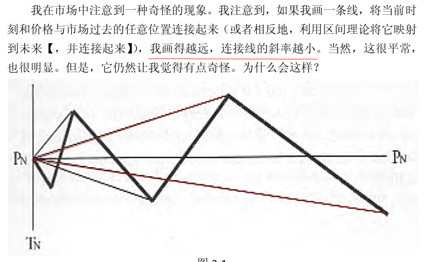
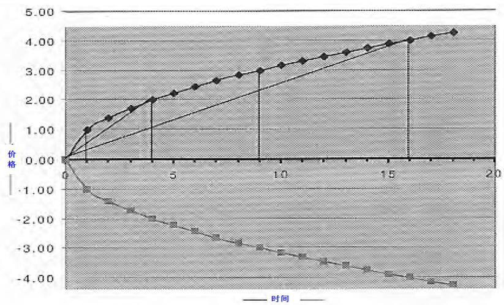
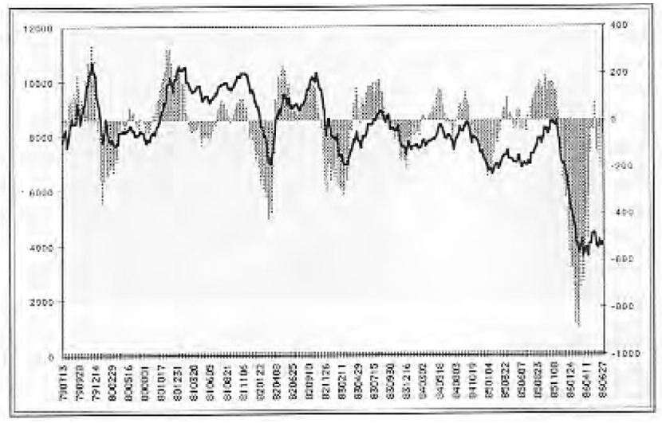
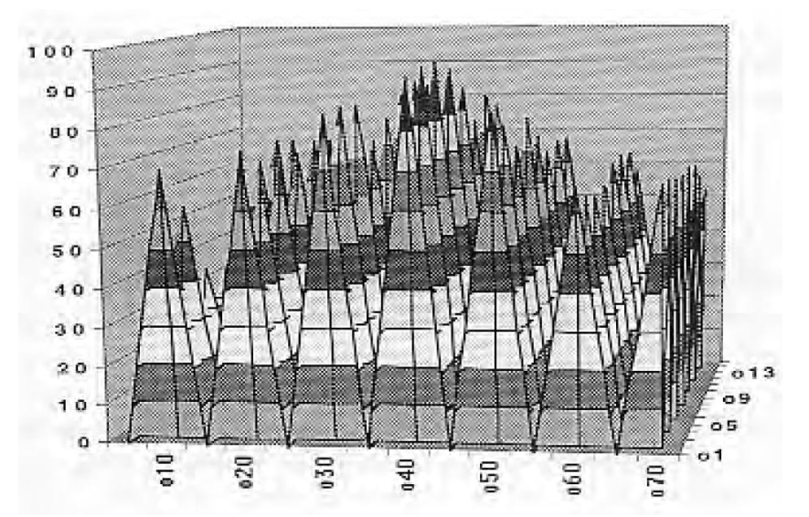
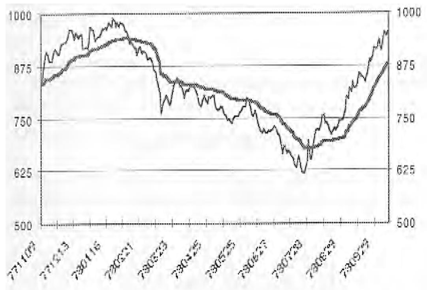

# 海洋等式

我在市场中注意到一种奇怪的现象。我注意到，如果我画一条线，将当前时
刻和价格与市场过去的任意位置连接起来（或者相反地，利用区间理论将它映射
到未来【，并连接起来】），**我画得越远，连接线的斜率越小**。当然，这很平常，
也很明显。但是，它仍然让我觉得有点奇怪。为什么会这样？

实际上，时间周期与市场周期是不能直接比较的。

我的兴趣是，市场趋向于在不同时间周期内运行多大。我不关心市场在特定
时间周期里，是否在上涨或下跌，**我的兴趣是它的走势多大**。

价格运动一般按照时间的平方根改变。
1/2
表示为公式是：$\Delta P = \sqrt{\Delta T}$

# 海洋指数

比方说，时间按天测量——尽管它可以是任何时间周期。注意在1天的收盘，
价格将向上或向下运动一个价格单位。在 4 天收盘，价格平均起来向上或向下运
动 3 个单位（9 的平方根），依此类推。这是随着时间的扩展，市场距离它当前起
点的平均价格。

知道了这一点，通过了解其他时间周期里的平均运动，我们就可以预测一天
的平均运动，例如，在上图中，我们取 16 天的平均价格运动——4 个单位——将
它除以 4（16 的平方根）就得到一天的平均运动。

相似地，比方说，我们可以取 11 天的平均价格运动，除以 11 的平方根，就
得到 1 天的平均运动预测值。

请注意，既然我们使用对数而不是价格本身，那么我们（隐含地）正在这里
研究百分比变化，而不是绝对变化。这让我们能够直接将任意市场里的价格变化
与其他任意市场的价格变化相比较。

放在一起，这意味着在任意市场里的任意时间间隔的海洋指数，可以直接与
任意其他市场里的其它时间间隔的海洋指数相比较。或者换个角度来说，海洋指
数提供了一种方式，来同时比较所有市场里的所有时间间隔。

海洋指数 /2 即 o2，是今天的对数价格与 2 天前的对数价格之差，除以 2 的
平方根将它规范化。海洋指数 /3， 即 o3，是今天的对数价格与 3 天前的对数价格
之差，除以 3 的平方根，依此类推。

# 自然市场镜像

# 自然移动均线

在计算指数的常数时，我让 NMR 的绝对值作分子，随着价格从当前时刻向
前运动，它自然地逐步递减。分母就变成用来计算 NMR 的数据这段时间里的 o1
（绝对值）之和。如果我们提供 40 天（或单位时间）的数据来计算 NMR，那么
我们就要为分母提供 40 天（或单位时间）的 o1。
然后，结果被用作正常计算 EMA 时的常数。
分母是价格的自然对数的绝对变化值之和。分子也是这些改变，不过是针对
随着时间推移而影响递减，来自然地（按照时间平方根之差）调整。
结果，自然移动平均即 NMA，自动地根据波动性调整，无需被预先设计调整，并且无需引入常数。它看起来像这样：

公式看起来像这样：

$$NMA_0=\frac{|NMR|}{|o1s|}(NMR-NMA -1 )\times NMA -1$$
